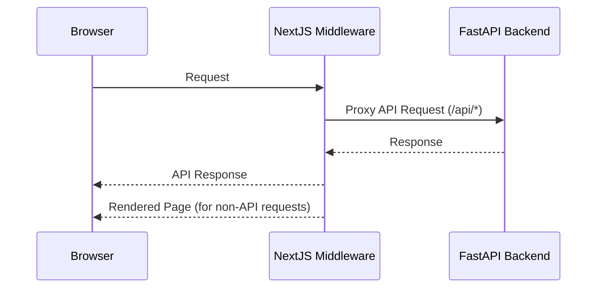

Is it any good?
yes

# How does it work?

1. For simple use cases we could just serve html from fastAPI
2. For more complex use cases we would use all components




# Requirements

## backend

### requirements
1. [Install uv](https://docs.astral.sh/uv/getting-started/installation/)
2. [Install docker](https://docs.docker.com/desktop/setup/install/mac-install/)
3. Run local mongo instance
```bash
docker run -p 27017:27017 -d mongo
```
---
### local development
1. Go to backend folder
2. Copy create `.env` based on `.env.example` in backend folder and set correct configuration properties
3. Run local server (environment should be automaticly created by uv with correct python and correct dependencies)
```
uv run fastapi dev
```

*This modular package structure is inspired by https://github.com/zhanymkanov/fastapi-best-practices

## frontend

### requirements
1. [Install bun](https://bun.sh/docs/installation)

###  local development
2. Go to frontend folder
3. Install packages 
```bash
bun i
```
4. Run application
```bash
bun run dev
```


# Tricks

## UI 

For the ui use https://ui.shadcn.com/ which speeds up the development a lot!

## Api changes

FastApi by default uses OpenAPI specification. After any changes to the api you can use frontend script that will create typescript types based on that by running
```bash
bun run generate:types
```
