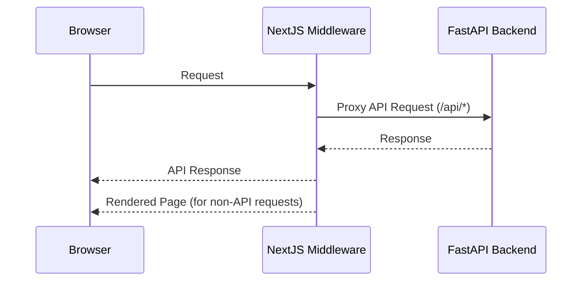

# Math LLM + Solvers

### By far the most accurate Math solving LLM 

This repository implements a hybrid pipeline that combines large language models (LLMs) with symbolic and numeric solvers to accurately solve and explain mathematical problems across various domains (algebra, ODEs, PDEs, logic puzzles, and more), by leveraging Mathstral for step-by-step derivations and Codestral for code generation, then cross-checking with formal solvers like Z3 and Sympy. We achieve both human-readable solutions and machine-verified correctness.


### Part - 1 
#### The solver implementation is a novel extension of the base paper, `*Why hardcode solvers? When you can dynamically generate the solver's constraints? *`
> **Neuro Symbolic Reasoning for Planning: Counterexample Guided Inductive Synthesis Using Large Language Models and Satisfiability Solving**  
> by Jha et al.


#### why is it any better than existing large reasoning models? Because none of them use `rigorous solvers` to verify the generated solutions. Which is why people still prefer Wolframe|Alpha, but it requires rigid input constraints. 


### What's the worst possible thing that can happen? 
> Solver code doesn't compile or execute.
Then, consider there is a chance of hallucination, and you solve the problem or hard code the solver\\
> *The probability of a solver and the LLM giving the same wrong answer is almost non-existent*

---

## Features

- **Step-by-Step Derivation:** Uses [`Mistralai/Mathstral-7B-v0.1`](https://huggingface.co/Mistralai/Mathstral-7B-v0.1) to generate detailed, natural-language solution steps.  
- **Code Generation:** Uses [`Mistralai/Codestral-latest`](https://huggingface.co/Mistralai/Codestral-latest) to produce Python code targeting solvers (Z3, Sympy, etc.) for specific mathematical domains.  
- **Automated Verification:** Executes generated code; if the solver’s numeric or symbolic result disagrees with Mathstral’s, automatically feeds the solver’s counterexample back into Mathstral for a refined derivation.  
- **Modular Domains:** Easily extendable support for algebra, ODEs, PDEs, logic, and additional areas.  
- **Configurable Backends:** Plug in different versions of Z3, Sympy, or other solver engines.

---

## Architecture


Is it any good?
yes

# How does it work?

1. For simple use cases we could just serve html from fastAPI
2. For more complex use cases we would use all components




# Requirements

## backend

### requirements
1. [Install uv](https://docs.astral.sh/uv/getting-started/installation/)
2. [Install docker](https://docs.docker.com/desktop/setup/install/mac-install/)
3. Run local mongo instance
```bash
docker run -p 27017:27017 -d mongo
```
---
### local development
1. Go to backend folder
2. Copy create `.env` based on `.env.example` in backend folder and set correct configuration properties
3. Run local server (environment should be automaticly created by uv with correct python and correct dependencies)
```
uv run fastapi dev
```

*This modular package structure is inspired by https://github.com/zhanymkanov/fastapi-best-practices

## frontend

### requirements
1. [Install bun](https://bun.sh/docs/installation)

###  local development
2. Go to frontend folder
3. Install packages 
```bash
bun i
```
4. Run application
```bash
bun run dev
```


# Tricks

## UI 

For the ui use https://ui.shadcn.com/ which speeds up the development a lot!

## Api changes

FastApi by default uses OpenAPI specification. After any changes to the api you can use frontend script that will create typescript types based on that by running
```bash
bun run generate:types
```
